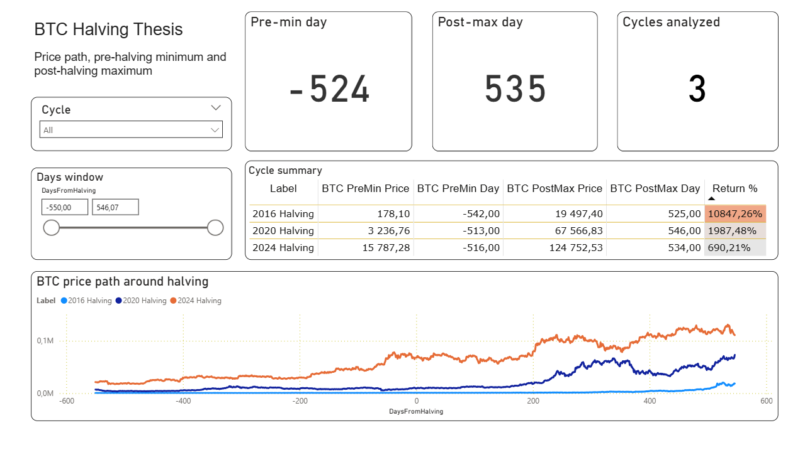
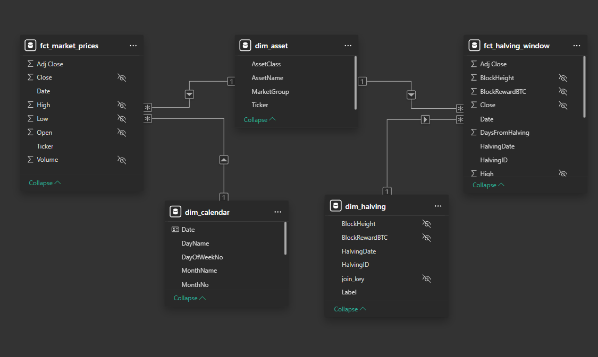

# bitcoin-halving-market-impact

Event-based analysis of BTC, ETH and selected US large-cap stocks around Bitcoin halving dates using Python, Power Query and Power BI.

## Project status

The Power BI report is **complete (final version)**.

The final dashboard is a multi-page, interactive Power BI report with page navigation, custom tooltips and custom visuals. It covers the full intended scope: a BTC-focused overview, per-cycle halving analysis, and cross-asset comparison across BTC, ETH and selected US large-cap stocks.

This remains a **portfolio project** focused on descriptive analysis — see the Limitations section below.

## Project goal

The goal of this project is to analyze how selected market assets behaved in time windows around Bitcoin halving events.

The project is focused on **descriptive analysis**, not causal claims.
It shows how prices, local lows, post-halving highs and selected event-window metrics behaved around known Bitcoin halving dates.

## Scope

- Bitcoin (`BTC-USD`)
- Ethereum (`ETH-USD`)
- selected US large-cap stocks (AAPL, AMZN, GOOGL, MSFT, NVDA)
- event windows aligned to Bitcoin halving dates

## Dashboard (final version)

The report is organized into navigable pages (with action-button navigation between them):

### 1. Przegląd (Overview)
BTC-focused overview answering: **how did Bitcoin behave around halving windows across historical cycles?**
- KPI / card visuals for key event-window metrics (pre-halving minimum day, post-halving maximum day, number of analyzed cycles),
- a line chart of BTC price paths around halving dates,
- an area chart, a summary table and a detail (pivot) table,
- cycle and days-from-halving slicers.

### 2. Cykle Halvingu (Halving Cycles)
Per-cycle breakdown of halving windows:
- card visuals for cycle-level metrics,
- column and line charts comparing behavior across cycles,
- slicers for cycle selection.

### 3. Porównanie (Comparison)
Cross-asset comparison across BTC, ETH and selected US equities:
- line chart and clustered column chart comparing assets,
- card visuals and a detail table,
- Chiclet Slicer (custom visual) for asset selection.

### 4. Porównanie halving (Halving Comparison)
Comparison focused on halving windows across assets:
- line chart and clustered bar chart,
- card visuals and two detail (pivot) tables,
- Chiclet Slicer for selection.

### 5. Dokumentacja (Documentation) & 6. Pomoc (Help)
In-report documentation and help pages describing the model, metrics and how to navigate the report.

The report also uses **custom tooltips** (dedicated tooltip pages) for richer hover detail, and custom visuals (Chiclet Slicer, Advance Card, Inforiver Filter).

## Data model

The report is built on a star-schema analytical model:
- fact tables for market prices and halving-window observations,
- dimension tables for assets, calendar dates and halving metadata,
- DAX measures for event-window metrics (local lows, post-halving highs, returns, averages).

## Tech stack

- Python
- Pandas
- yfinance
- Power Query
- Power BI (DAX, star-schema modeling, custom visuals)
- Git / GitHub

## Analysis approach

1. Download daily market data for crypto and selected equities (yfinance).
2. Prepare reference data for Bitcoin halving dates and asset metadata.
3. Align observations into event windows around halving dates.
4. Transform and model data (Power Query + star schema) for reporting.
5. Build interactive Power BI pages for exploratory and descriptive analysis.

## Limitations

- It does **not** attempt to prove that halving events directly caused price movements.
- The number of historical halving cycles is small.
- Cross-asset comparisons around halving dates should be treated as descriptive context, not hard evidence of market dependency.

## Screenshots

> Screenshots of the final multi-page report are being refreshed. The images below show the BTC overview page and the data model.

### Dashboard preview

### Data model

## Why this project

I built this project as a portfolio piece to demonstrate practical skills in:
- event-based analysis,
- financial data preparation,
- dimensional (star-schema) modeling for reporting,
- multi-page Power BI dashboard design with navigation, custom tooltips and custom visuals,
- combining Python, Power Query and BI reporting in one workflow.
